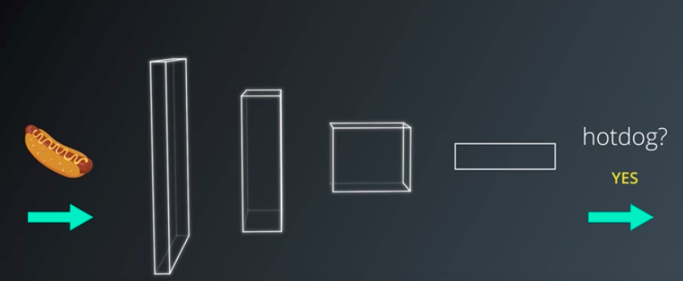
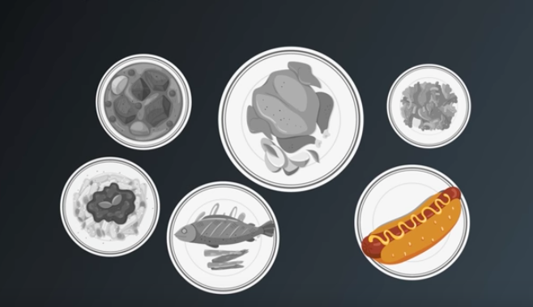
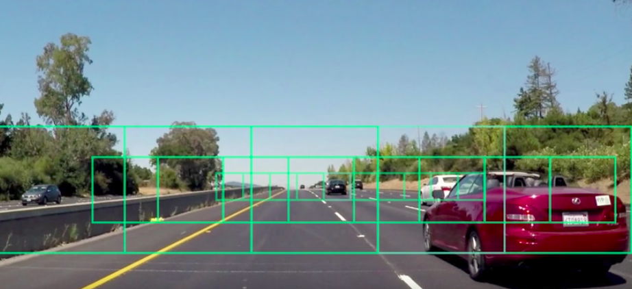

FCNs
========================================================
author: Karma Tarap & Alexander Noll
date: 26-10-2017
autosize: true

Problem
========================================================

Standard convolutional neural networks (CNNs) are good at **global classification**:

Problem
========================================================

What if we are interested in asking the question: where is the hotdog?

Problem
========================================================

So we have a local classification problem:

+ For each point of an image a class is supposed to be predicted
+ Numerous applications: e.g self-driving-cars (will be shown in code) use it for [drivable surface classification](https://www.youtube.com/watch?v=qWl9idsCuLQ)

<!--html_preserve--><iframe src="https://www.youtube.com/embed/qWl9idsCuLQ" width="630" height="472.5" frameborder="0" allowfullscreen=""></iframe><!--/html_preserve-->

Other approaches
========================================================
Sliding windows

Fully Convolutional Neural Networks
========================================================

End-to-end learning (i.e. no manual intervention, like in sliding windows) approach to image segmentation problem

+ They are a series of convolutional layers decreasing the size of the output
+ Followed by a series of **deconvolutional layers** or **transposed convolutional layers** or **upsampling layers** that increase the output size
+ Skip layers are very important for performance
+ Transfer learning for pre-training weights
